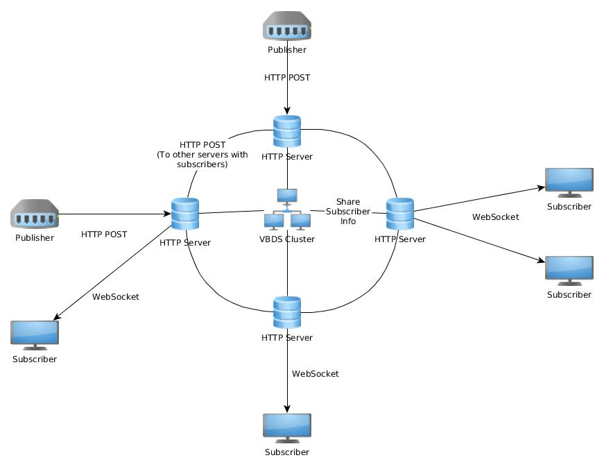

# VIZ Bulk Data System (VBDS)

This project contains a prototype of the VIZ Bulk Data System (VBDS).
The VBDS allows applications to publish images or other data to named streams and other applications to subscribe to those streams.
It is implemented as a cluster of HTTP servers that share subscriber information and transfer data to subscribers via websockets.
Applications use an HTTP/REST API to send commands to one of the servers in the cluster. 
If a data file is published to one remote server and there are multiple subscribers attached to another server, the published files are each
only transfered once to the other server, and then from there via websocket to each subscriber.

## Build

To build and install the applications, run: 

    sbt publishLocal stage

See [web/vbds-scala-js](web/vbds-scala-js) for instructions on how to build the JS9 based web app.

## Applications

The main application is an HTTP server called `vbds-server`:

```
vbds-server 0.0.1
Usage: vbds-server [options]

  -n, --name <name>        The name of this server(default: vbds)
  --http-host <hostname>   The HTTP server host name (default: 127.0.0.1)
  --http-port <number>     The HTTP server port number (default: 0)
  --akka-host <hostname>   The Akka system host name (default: 127.0.0.1)
  --akka-port <number>     The Akka system port number (default: 0)
  -s, --seeds <host>:<port>,<host>:<port>,...
                           Optional list of cluster seeds in the form host:port,host:port,...
  --help                   
  --version                
```

A `vbds-client` application is provided, for convenience and for use in tests, but any HTTP client will also work, as long as
it can handle the websocket responses for subscribers.
 
The `vbds-client` also demonstrates how you can access the vbds-server from Scala or Java code using akka-http, streams and actors.

Note that the data transfered via websocket to a subscriber is *chunked*: Multiple websocket messages are sent and the terminating 
message for each file contains a single newline "\n" byte, which does not belong to the data file. 

```
vbds-client 0.0.1
Usage: vbds-client [options]

  -n, --name <name>        The name of the vbds-server server(default: vbds)
  --host <host name>       The VBDS HTTP server host name (default: 127.0.0.1)
  -p, --port <number>      The VBDS HTTP server port number (default: 80)
  --create <stream name>   Creates a new VBDS stream with the given name
  --contentType <content-type>
                           Specifies the content type of the files in the stream
  --delete <stream name>   Deletes the VBDS stream with the given name
  -l, --list               List the available streams
  --stats                  Print timing statistics when publishing files
  --repeat                 Keep publishing the same files forever, until killed (for testing)
  --stats-interval <value>
                           If --stats option was given, controls how often statistics are printed (default: 1 = every time)
  --subscribe <stream name>
                           Subscribes to the given VBDS stream (see --action option)
  --dir <path>             Directory to hold received data files (default: current directory)
  -a, --action <shell-command>
                           A shell command to execute when a new file is received (args: file-name)
  --publish <stream-name>  Publish to the given stream (see --data option)
  --delay <duration>       Delay between publishing files in a directory (see --data)
  --data <file-name>       Specifies the file (or directory full of files) to publish
  --suffix <suffix>        Optional suffix for files to publish if the file given by --data is a directory
  --chunk-size <num-bytes>
                           Optional chunk size (to tune file transfer performance)
  --help                   
  --version                
```

## Web App to Display FITS Image from VBDS Streams

A prototype web app based on [Scala.js](https://www.scala-js.org/) and [JS9](https://js9.si.edu/) is available under 
[web/vbds-scala-js](web/vbds-scala-js). 

__Note__: In order to prevent overloading a subscriber when the publisher is too fast, a subscriber needs to reply on its websocket with a 
short "ACK" message after receiving each message (image fragment). 
This should prevent too many messages from being queued in a browser's websocket queue.


## VBDS REST API

| Description                   | Verb      | URI                               | Response |
| ----------------------------- |-----------|---------------------------------- |--------- |          
| List all streams              | GET       | /vbds/admin/streams              | OK (200) – Stream names in JSON; empty document if no streams
| Create a stream               | POST      | /vbds/admin/streams/{streamName}?contentType=... | OK (200) – New stream name in JSON; Conflict (409) if stream exists
| Delete a stream               | DELETE    | /vbds/admin/streams/{streamName} | OK (200) – Deleted stream name in JSON; NotFound (404) if stream does not exist
| Publish an image to a stream  | POST      | /vbds/transfer/streams/{streamName}/image | Accepted (204) – (no content); Bad Request (400) – for non-existent stream
| Create a subscription         | POST      | /vbds/access/streams/{streamName} | SwitchingProtocols (101) – Creates a websocket connection for receiving the data

To delete a subscription, just close the websocket for it. Subscriptions are automatically deleted if a client disconnects.

## Running the Server

You can test `vbds-server` by first starting an instance as a seed node (hostA). For example:

    vbds-server --http-host hostA --http-port 7777 --akka-host hostA --akka-port 8888 -s hostA:8888

and then starting one or more other instances on other hosts that can join the Akka cluster:

    vbds-server --http-host hostB --http-port 7777 --akka-host hostB -s hostA:8888

In the first case we specified an Akka port (8888) for the cluster seed node. In the second case, a random port was used,
since no -akka-port option was specified. We need to know the akka host and port for the seed node, 
and of course the HTTP host and port, so we can send requests to it.


### Test using vbds-client Application

Create a FITS stream named `WFS1-RAW`: (Note: The content type is optional, but may be used by image viewers)

    vbds-client --host hostA -p 7777 --create WFS1-RAW --contentType "image/fits"

Subscribe to the stream (`-a` or `--action` takes a shell command that receives a filename argument):

    vbds-client --host hostA --port 7777 --subscribe WFS1-RAW -a echo

Publish some data (Replace MyFile with the file name):

    vbds-client --host hostA -p 7777 --publish WFS1-RAW --data myFile.fits

Note that instead of a file, a directory can be specified, in which case all the files in the directory are sorted and sent (for testing).

### Test Using [curl](https://curl.haxx.se/) and [wscat](https://github.com/websockets/wscat)

Create a FITS stream named `WFS1-RAW`: (Note: The content type is optional, but may be used by image viewers)

    curl --request POST http://hostA:7777/vbds/admin/streams/WFS1-RAW?contentType=image/fits

Subscribe to the stream using wscat (Just for testing, with non-binary files: Install with `npm install -g wscat`).
(Note that you will need to type enter at the wscat prompt to simulate the client ACK responses.)

    wscat -c ws://hostA:7777/vbds/access/streams/WFS1-RAW

Publish some data (Replace MyFile with the file name):

    curl --request POST -F data=@MyFile http://hostA:7777/vbds/transfer/streams/WFS1-RAW

The data should be displayed in the stdout of the wscat application. 


## Multi-jvm and Multi-Node Tests

The multi-jvm directory contains a test that uses multiple servers, publishers and subscribers.

To test locally on different JVMs, run: 

    sbt multi-jvm:test

To test with remote hosts, set the `multiNodeHosts` environment variable to a comma separated list of hosts and 
then run `sbt multiNodeTest`. For example: 

    export multiNodeHosts="username@hostA,username@hostB"
    sbt multiNodeTest

This copies the necessary jars to the `~/multi-node-test` dir on each host and runs a part of the test there.
There are other settings that might be of interest. 
See [Multi Node Testing](https://doc.akka.io/docs/akka/current/multi-node-testing.html).

## Testing on AWS

Assuming you have two (or more) CentOS hosts on [AWS](https://aws.amazon.com/) and you want to run the multi-node tests, 
there are some issues to consider: 

* The local system administrator (who has the AWS account) needs to configure the nodes to open the required ports 
  (or all ports, if random ports are used).
  Otherwise communication between the hosts will be blocked, exxcept for ssh connections.

* If you want to run the multi-node test (`sbt multiNodeTest`), you should check out the vbds source code on one of the AWS hosts 
  and run the sbt command from there using the internal IP addresses, which are different than the public IP addresses 
  that would be needed from the outside.
  
* The same goes for testing manually with the vbds-server command line app: Use the internal IP addresses, otherwise there will be
  problems with the cluster.


## Performance Test Results on 10 gigabit AWS Servers

The VBDS was tested with one Publisher, two servers and two subscribers: One subscriber on host A, one subscriber on host B (publisher on host A).
The tests were performed on two AWS hosts with a 10 gigabit ethernet connection and CPU: Intel(R) Xeon(R) Platinum 8175M CPU @ 2.50GHz.
Note: These tests only measure the throughput: The data is not processed in these tests:

| Image Size                   | Images/Sec (hz) |
| -----------------------------|-----------------|          
| 48   x   48 x 2              | 270.929         |
| 128  x  128 x 2              | 306.185         |
| 256  x  256 x 2              | 233.699         |
| 512  x  512 x 2              | 149.231         |
| 1024 x 1024 x 2              | 60.252          |
| 2048 x 2048 x 2              | 18.916          |
| 4096 x 4096 x 2              | 5.314           |

# Performance Test Results using an Embedded Instance of JS9

These are the results of testing the image display performance using the web app in [web/vbds-scala-js](web/vbds-scala-js)
running locally on a Linux laptop with an Intel Core i7-6820HQ CPU @ 2.70GHz:

## JS9 FITS Display

| Image Size                   | Images/Sec (hz) |
| -----------------------------|---------------- |          
| 128  x  128 x 2              | 35              |
| 512  x  512 x 2              | 12              |
| 1024 x 1024 x 2              | 7               |
| 2048 x 2048 x 2              | 2               |

## JS9 JPEG Display

| Image Size                   | Images/Sec (hz) |
| -----------------------------|---------------- |          
| 128  x  128 x 2              | 39              |
| 512  x  512 x 2              | 27              |
| 1024 x 1024 x 2              | 16              |
| 2048 x 2048 x 2              | 5.5             |


## HTML Canvas JPEG Display

| Image Size                   | Images/Sec (hz) |
| -----------------------------|---------------- |          
| 128  x  128 x 2              | 145              |
| 512  x  512 x 2              | 130              |
| 1024 x 1024 x 2              | 57               |
| 2048 x 2048 x 2              | 22               |

## Latency

Here are some latency measurements from running VBDS with one server and one client, 
both on the local host (A Lenovo Thinkpad P70): (Measures the time to publish a file without writing it to disk or displaying it): 

### Average latency in seconds for FITS files on localhost (16 bit short data):

| Image Size  | Min    | Max    | Average |
| ------------|--------|--------|------- |          
| 128 x 128   | 0.0010 | 0.0520 | 0.0027 |
| 512 x 512   | 0.0030 | 0.0510 | 0.0055 |
| 1024 x 1024 | 0.0100 | 0.0650 | 0.0158 |
| 2048 x 2048 | 0.0310 | 0.0880 | 0.0394 |


### Performance issues: Fast publisher, Fast and Slow Subscribers

Akka streams are used in the tests on both client and server, with websockets in the middle.
Obviously, if one of the subscribers is too slow, it will either have to buffer the received images, or skip some of them.
Since the image data is sent in "chunks", just dropping a single websocket message would result in a corrupted image.
The code would have to be smart enough to drop everything up until the next image. 
For this reason a client websocket acknowledgement message is currently required. This makes it possible to have back-pressure
from the web-client all the way back to the publisher.

In the current test-client implementation, the received data is saved to temp files, the file names are streamed to the
receiver and each received file is deleted when done.

In the current implementation a slow client will cause the publisher to publish at a slower rate.
If this turns out to be a problem, it might be necessary to allow the subscribers to specify a slower rate, 
change the publisher to drop images when needed, or make the server smart enough to only drop images for slower subscribers.

## Implementation Notes

This is the basic flow of a published data file:

* When a VBDS client publishes a data file, the client POSTS the data to the VBDS HTTP server.

* The VBDS server receives the data in chunks and broadcasts it (using Akka Streams) to the local subscriber's websockets 
  and also POSTS the data to any other VBDS servers that have subscribers for that stream 
  (The websocket writes and HTTP POSTS are both in the same broadcast graph).

* The other VBDS servers that receive the data also broadcast it to their subscribers.

* On the client side, the clients receive multiple websocket messages for each data file, 
  ending with a message containing a single newline, which is not part of the data.
  The clients need to collect the data until the file is complete and then can display it, do calculations, etc.
  The client also needs to acknowledge each websocket message with a short "ACK" message, for flow control reasons
  (to enable back-pressure back to the publisher).
  
### Basic VBDS Flow



  
